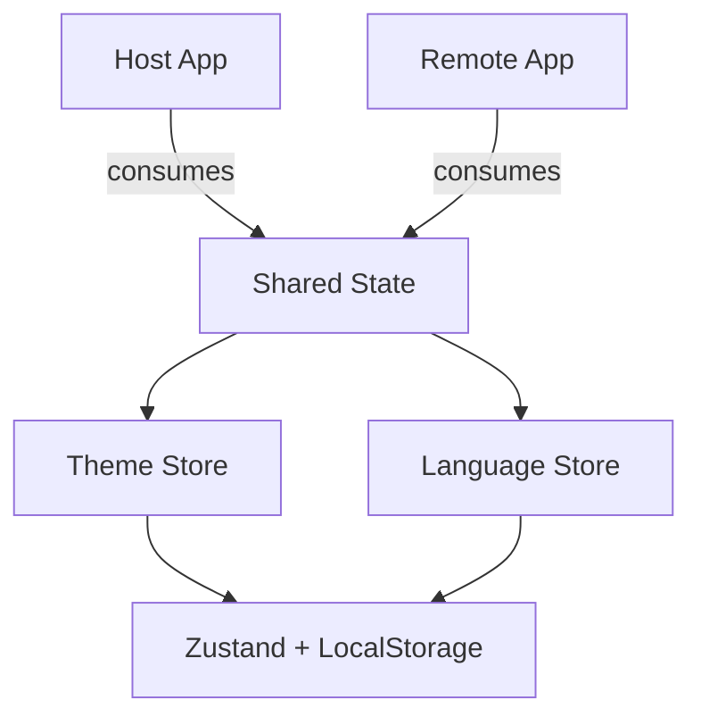
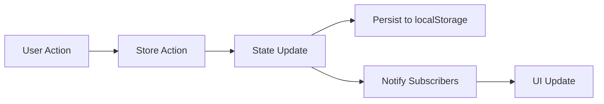

# Shared State

Global state management shared across applications via Module Federation.

## 📦 Architecture



## 🎯 Responsibility

Global state shared across **all applications** (Host and Remote):
- 🌓 **Theme**: Theme management (light/dark/system)
- 🌐 **Language**: Language management (pt/en)
- 📚 **i18n**: Centralized translations
- 🎨 **Styles**: Shared global styles

## 🔄 Data Flow



## 📂 Structure

```
shared-state/
├── src/
│   ├── stores/        # Zustand stores
│   │   ├── theme/     # Theme store and selectors
│   │   └── language/  # Language store and selectors
│   ├── i18n/          # Translations
│   └── styles/        # Global styles
└── vite.config.ts     # Module Federation config
```

## 🚀 Usage

```typescript
// Consume from any app
import { useThemeStore, useLanguageStore } from "shared-state/stores";
import { ThemeButton, LanguageButton } from "shared-state/components";

// Use in components
const theme = useThemeStore((state) => state.resolvedTheme);
```

## 🔗 Integration

Exposes via Module Federation to be consumed by:
- **Host**: Main layout and components
- **Remote**: Global components and content
