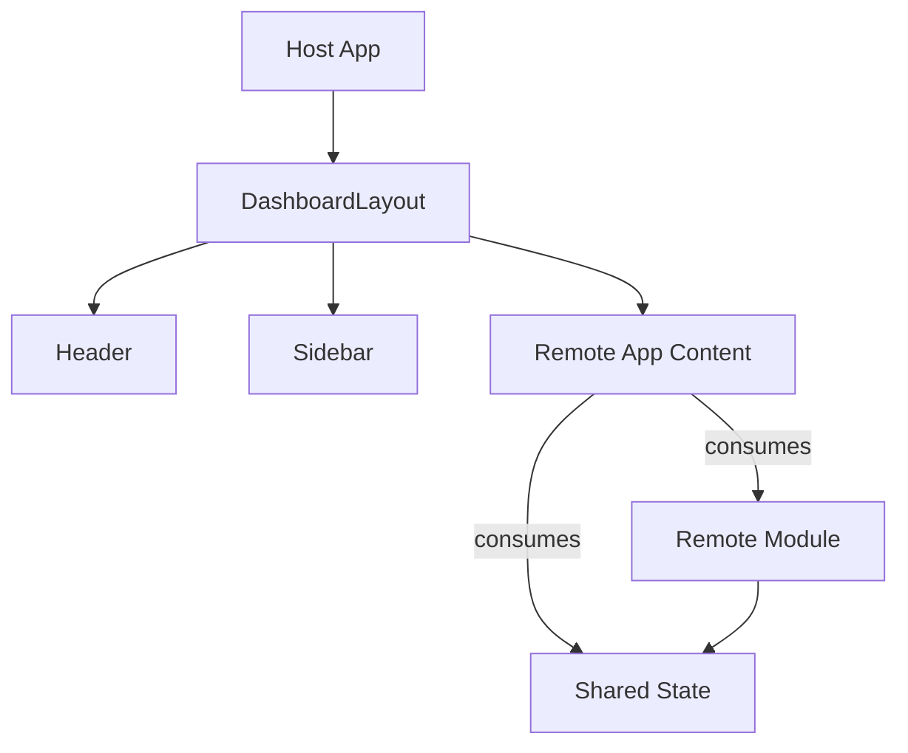
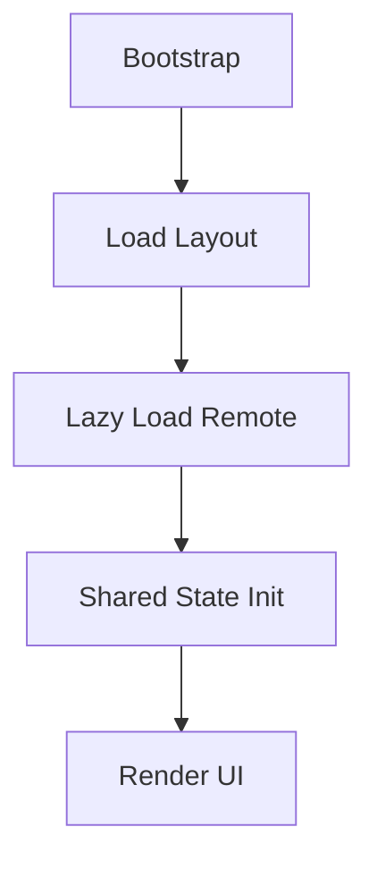

# Host App

Main application that orchestrates the Micro Frontends system.

## 📦 Architecture



## 🎯 Responsibility

**Shell** application that:
- 🏗️ **Layout**: Base structure (Header, Sidebar, Content)
- 🔗 **Orchestration**: Consumes remote modules via Module Federation
- 🎨 **UI**: Responsible for user experience

## 🔄 Application Flow



## 📂 Structure

```
host/
├── src/
│   ├── components/
│   │   ├── organisms/     # Header, Sidebar
│   │   └── templates/     # DashboardLayout
│   └── App.tsx            # Shell app
└── vite.config.ts         # Module Federation remotes
```

## 🚀 Loading

```typescript
// Remote configuration
remotes: {
  'vite_remote': {
    entry: 'http://localhost:5174/remoteEntry.js',
  },
  'shared-state': {
    entry: 'http://localhost:5175/remoteEntry.js',
  },
}
```

## 🔗 Dependencies

- **Remote App**: Content and global components
- **Shared State**: Global state (theme, language)
- **Zephyr Cloud**: Automatic deployment and resolution

## 📱 Responsive

- Desktop (≥769px): Sidebar always visible
- Mobile (<769px): Collapsible sidebar
- Suspense boundaries for loading states
