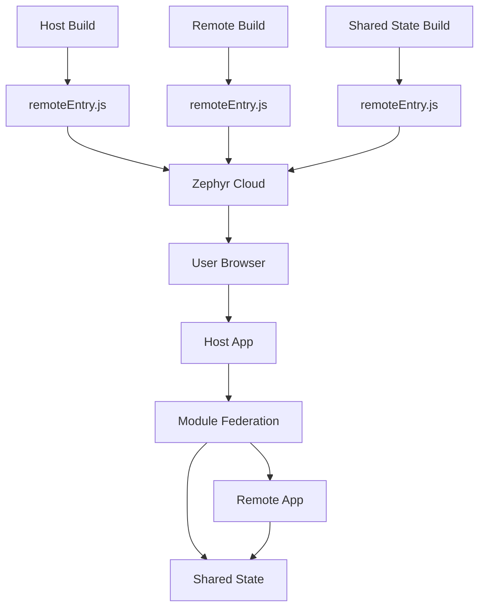
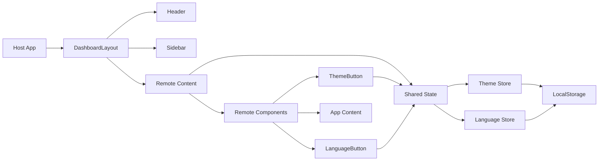
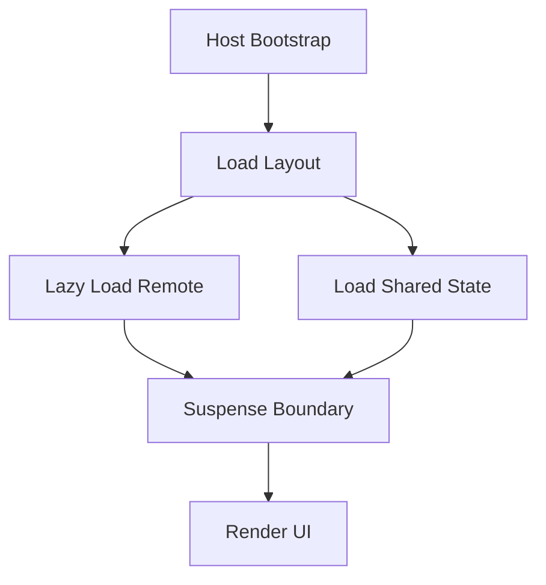
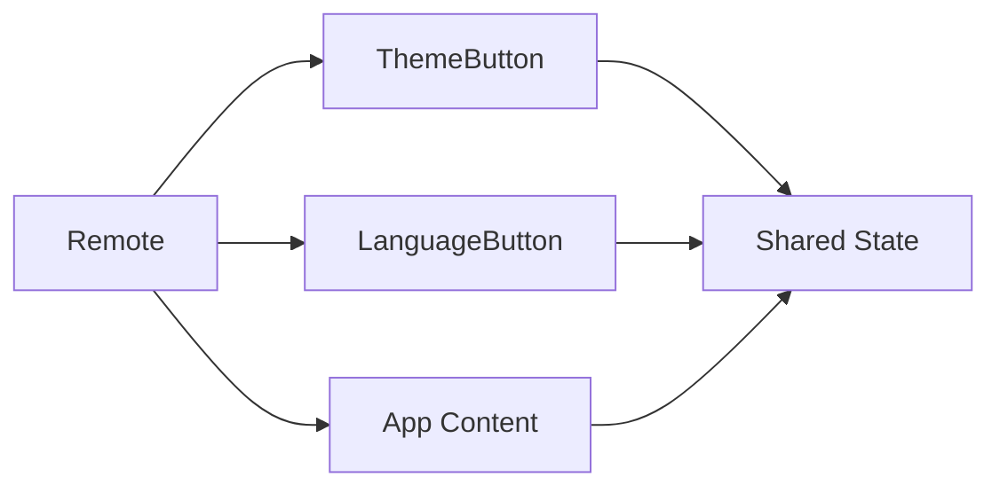
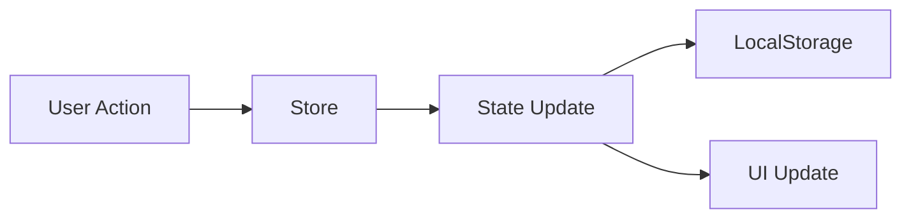
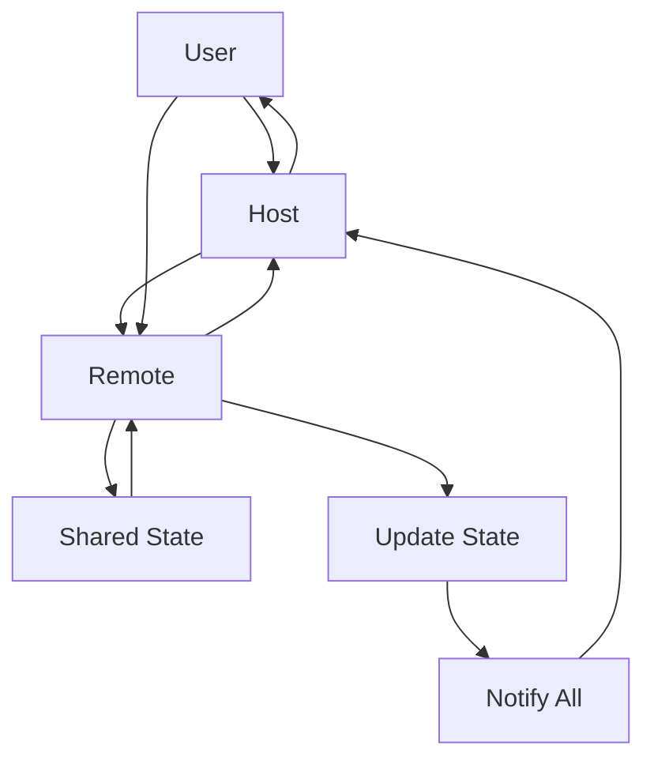

# 🚀 Module Federation + Zephyr Cloud Demo

A complete example of a Micro-Frontends architecture using Module Federation with native Zephyr Cloud integration.


## 📋 Overview

This project demonstrates a modern Micro-Frontends architecture where:

- **Host Application**: Main application that consumes remote components
- **Remote Application**: Library of reusable components exposed via Module Federation
- **Shared State**: Global state management shared across all applications
- **Zephyr Cloud**: Automatic orchestration and deployment of federated modules

## 🏗️ Architecture Overview



## 🎯 Project Structure



## 📦 Modules

### Host Application

**Port:** 5173

Main shell application that orchestrates the entire system.



### Remote Application

**Port:** 5174

Library of globally shared components.



### Shared State

**Port:** 5175

Global state management using Zustand with Module Federation.



## 🔄 Data Flow



## 🏗️ Project Structure

```
mfe/
├── host/              # Host Application (shell)
│   ├── src/
│   │   ├── App.tsx    # Main shell app
│   │   ├── components/
│   │   │   ├── organisms/  # Header, Sidebar
│   │   │   └── templates/  # DashboardLayout
│   └── vite.config.ts # Module Federation config
│
├── remote/            # Remote Application (library)
│   ├── src/
│   │   ├── App.tsx    # Main content
│   │   └── components/
│   │       ├── ThemeButton
│   │       └── LanguageButton
│   └── vite.config.ts # Module Federation exposes
│
├── shared-state/      # Shared State (global)
│   ├── src/
│   │   ├── stores/    # Zustand stores
│   │   ├── i18n/      # Translations
│   │   └── styles/    # Global styles
│   └── vite.config.ts # Module Federation config
│
├── docs/              # Generated documentation
├── typedoc.json       # TypeDoc configuration
└── package.json       # Root workspace config
```

## 🚀 Getting Started

### Prerequisites

- **Node.js** >= 16
- **pnpm** (package manager)
- Account on [Zephyr Cloud](https://app.zephyr-cloud.io/)

### Installation

```bash
# Install dependencies
pnpm install
```

### Local Development

```bash
# Start all apps in parallel
pnpm dev

# Or start individually:
pnpm dev-host         # Host on port 5173
pnpm dev-remote       # Remote on port 5174
pnpm dev-shared-state # Shared State on port 5175
```

**Development URLs:**

- **Host**: http://localhost:5173
- **Remote**: http://localhost:5174
- **Shared State**: http://localhost:5175

### Production Build

```bash
# Build all applications in order
pnpm build

# Or individually:
pnpm build-shared-state  # Shared State first
pnpm build-remote        # Remote second
pnpm build-host          # Host last
```

## 📚 Documentation

Generate interactive documentation with TypeDoc:

```bash
pnpm docs:serve
# http://localhost:3000
```

Access documentation at: **http://localhost:3000**

## ☁️ Deploy with Zephyr Cloud

### Initial Setup

1. **Login to Zephyr Cloud**

   - Visit https://app.zephyr-cloud.io/
   - Sign in to the platform

2. **Configure Authentication**
   - The `vite-plugin-zephyr` plugin automatically detects credentials
   - Configure environment variables or tokens as needed

### Deployment Process

Deployment happens automatically during build:

```bash
# Build and deploy Shared State
pnpm build-shared-state

# Build and deploy Remote
pnpm build-remote

# Build and deploy Host
pnpm build-host
```

**What happens during build:**

1. Application compilation
2. Automatic asset upload to Zephyr Cloud
3. Version registration (SemVer)
4. Production URL generation
5. Automatic dependency resolution between modules

## 🎯 How It Works

### Module Federation

Module Federation allows JavaScript applications to share modules at **runtime**, not at compile time:

```typescript
// host/src/components/DashboardLayout.tsx
const RemoteApp = lazy(() => import("vite_remote/App"));

// Component loaded dynamically when needed
<RemoteApp />;
```

### Remote Configuration

```typescript
// remote/vite.config.ts
exposes: {
  './ThemeButton': './src/components/ThemeButton',
  './LanguageButton': './src/components/LanguageButton',
  './App': './src/App',
}
```

### Host Configuration

```typescript
// host/vite.config.ts
remotes: {
  'vite_remote': {
    entry: 'http://localhost:5174/remoteEntry.js', // Dev
    // In production, Zephyr resolves automatically
    type: 'module',
  },
  'shared-state': {
    entry: 'http://localhost:5175/remoteEntry.js',
    type: 'module',
  },
}
```

### Shared Dependencies

React, ReactDOM, and Zustand are shared between Host and Remote to avoid duplication:

```typescript
shared: {
  react: { singleton: true },
  'react-dom': { singleton: true },
  zustand: { singleton: true },
}
```

## 📦 Available Scripts

| Command                   | Description                |
| ------------------------- | -------------------------- |
| `pnpm dev`                | Start all apps in parallel |
| `pnpm dev-host`           | Start only the host        |
| `pnpm dev-remote`         | Start only the remote      |
| `pnpm dev-shared-state`   | Start only shared-state    |
| `pnpm build`              | Build all apps (in order)  |
| `pnpm build-host`         | Build only host            |
| `pnpm build-remote`       | Build only remote          |
| `pnpm build-shared-state` | Build only shared-state    |
| `pnpm preview`            | Preview host build         |
| `pnpm docs`               | Generate documentation     |
| `pnpm docs:serve`         | Generate and serve docs    |
| `pnpm docs:watch`         | Watch mode for docs        |

## 🔧 Technologies

- **React 18** - UI library
- **TypeScript** - Type safety
- **Vite** - Build tool and dev server
- **Module Federation** - Micro frontends architecture
- **Zustand** - State management
- **Zephyr Cloud** - Deployment and orchestration platform
- **pnpm** - Package manager with workspace support
- **TypeDoc** - Documentation generator

## 📖 Additional Documentation

- [Host App Details](./host/README.md) - Host application architecture
- [Remote App Details](./remote/README.md) - Remote components library
- [Shared State Details](./shared-state/README.md) - Global state management
- [Detailed Explanation](./EXPLICACAO.md) - Complete guide on how everything works
- [Module Federation Docs](https://module-federation.io/)
- [Zephyr Cloud Docs](https://docs.zephyr-cloud.io/)
- [Vite Documentation](https://vitejs.dev/)

## 🎓 Key Concepts

### Runtime vs Build-time

- **Runtime**: Components loaded when needed, at runtime
- **Build-time**: Host and Remote built independently

### Independent Deployment

- Remote can be updated without redeploying Host
- Host automatically loads latest version (per versioning policy)
- Granular rollback possible

### Shared Dependencies

- React and ReactDOM are singleton shared
- Avoids code duplication
- Ensures compatibility between components

## 💡 What This Project Demonstrates

1. **Micro-Frontends Architecture**: How to split an application into independent modules
2. **Module Federation**: Dynamic component loading at runtime
3. **Zephyr Cloud Integration**: Automatic deployment and module orchestration
4. **Independent Development**: Teams can work separately
5. **Independent Deployment**: Updates without full application redeploy
6. **Global State Management**: Shared state across multiple applications
7. **Atomic Design**: Component organization patterns

## 📝 License

This project was created as part of a technical assessment.

---

**Developed with ❤️ using Module Federation and Zephyr Cloud**
