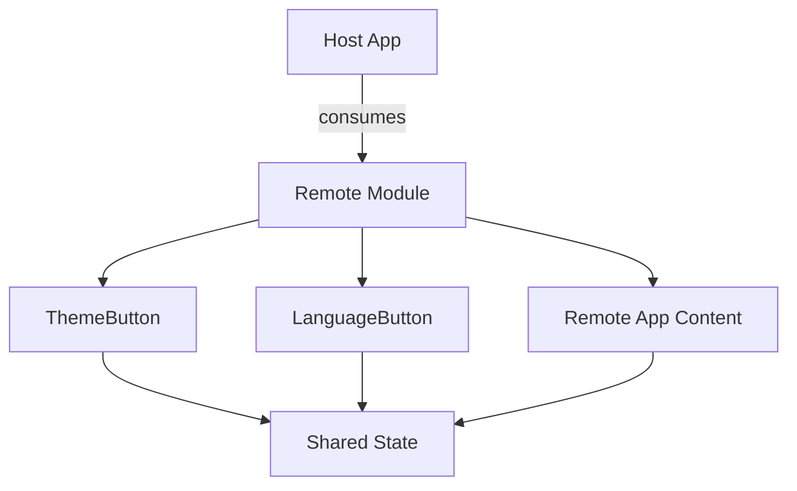
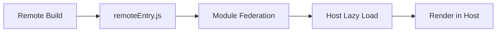

# Remote App

Library of globally shared components via Module Federation.

## 📦 Architecture



## 🎯 Responsibility

**Reusable** components exposed to the Host:
- 🎨 **ThemeButton**: Toggles light/dark theme
- 🌐 **LanguageButton**: Toggles pt/en language
- 📱 **Remote App**: Main dashboard content

## 🔄 Integration Flow



## 📂 Structure

```
remote/
├── src/
│   ├── components/    # Shared components
│   │   ├── ThemeButton
│   │   ├── LanguageButton
│   │   └── App.tsx    # Main content
│   └── App.css        # Isolated styles
└── vite.config.ts     # Module Federation exposes
```

## 🚀 Exposure

```typescript
// Expose in vite.config.ts
exposes: {
  './ThemeButton': './src/components/ThemeButton',
  './LanguageButton': './src/components/LanguageButton',
  './App': './src/App',
}
```

## 🔗 Dependencies

- Consumes **Shared State** for store access
- Shares React, ReactDOM and Zustand with Host
- Independent deployment via Zephyr Cloud

## 📱 Usage in Host

```typescript
// Lazy load in Host
const RemoteApp = lazy(() => import("vite_remote/App"));
const ThemeButton = lazy(() => import("vite_remote/ThemeButton"));

// Render with Suspense
<Suspense fallback={<Loading />}>
  <RemoteApp />
</Suspense>
```
