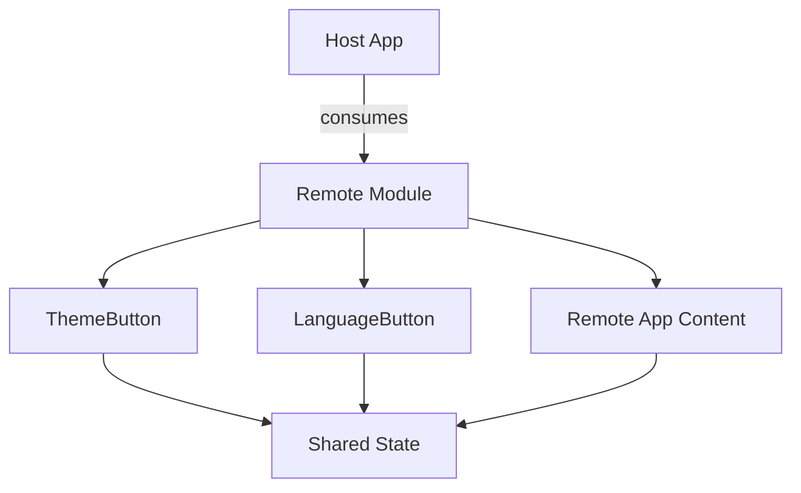
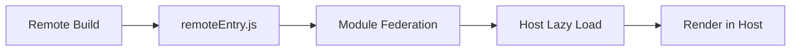

# Remote App

Library of globally shared components via Module Federation.

## 📦 Architecture



## 🎯 Responsibility

**Reusable** components exposed to the Host:
- 🎨 **ThemeButton**: Toggles light/dark theme
- 🌐 **LanguageButton**: Toggles pt/en language
- 📱 **Remote App**: Main dashboard content

## 🔄 Integration Flow



## 📂 Structure

```
remote/
├── src/
│   ├── components/    # Shared components (Atomic Design)
│   │   ├── atoms/     # Basic components
│   │   │   ├── ThemeButton/
│   │   │   └── LanguageButton/
│   │   ├── molecules/ # Atom combinations
│   │   ├── organisms/ # Complex components
│   │   ├── templates/ # Layouts
│   │   └── index.ts   # Barrel exports
│   ├── App.tsx        # Main content
│   └── App.css        # Isolated styles
└── vite.config.ts     # Module Federation exposes
```

### 🎯 Atomic Design Organization

The components follow the **Atomic Design** pattern, organizing components by complexity:

- **Atoms**: Basic, indivisible components (`ThemeButton`, `LanguageButton`)
- **Molecules**: Simple combinations of atoms (currently empty)
- **Organisms**: Complex components (currently empty)
- **Templates**: Layout structures (currently empty)

See [components/README.md](./src/components/README.md) for detailed documentation.

## 🚀 Exposure

```typescript
// Expose in vite.config.ts
exposes: {
  './ThemeButton': './src/components/atoms/ThemeButton',
  './LanguageButton': './src/components/atoms/LanguageButton',
  './App': './src/App',
}
```

Components are organized using Atomic Design pattern. Atoms (`ThemeButton` and `LanguageButton`) are exposed individually for granular consumption.

## 🔗 Dependencies

- Consumes **Shared State** for store access
- Shares React, ReactDOM and Zustand with Host
- Independent deployment via Zephyr Cloud

## 📱 Usage in Host

```typescript
// Lazy load in Host
const RemoteApp = lazy(() => import("vite_remote/App"));
const ThemeButton = lazy(() => import("vite_remote/ThemeButton"));

// Render with Suspense
<Suspense fallback={<Loading />}>
  <RemoteApp />
</Suspense>
```
